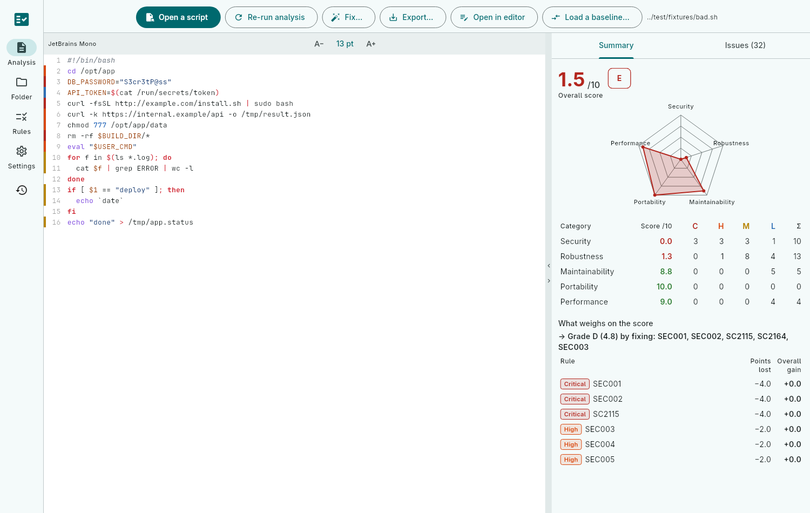
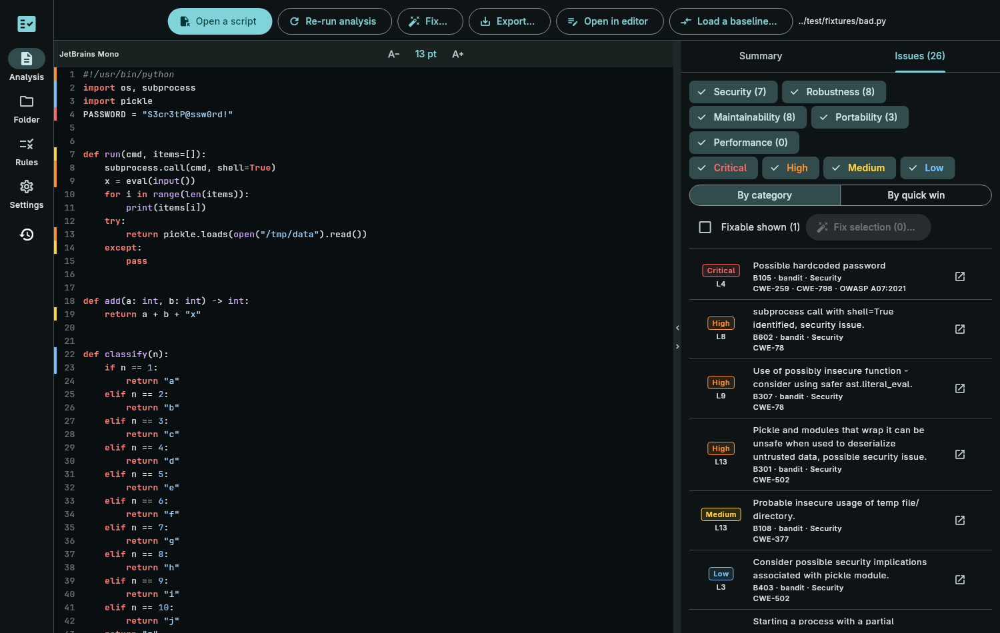
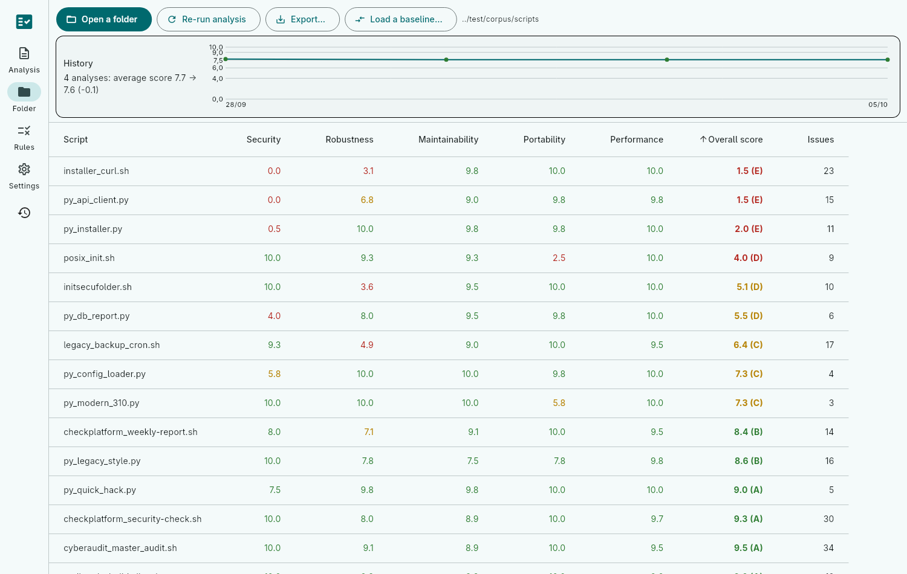
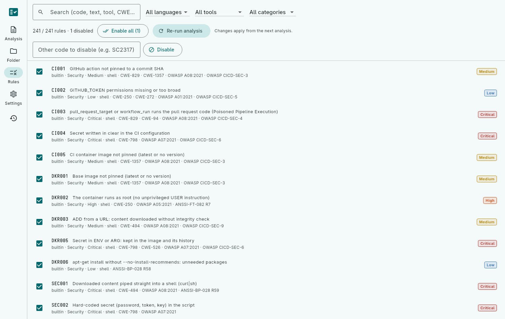

# CheckScript — `check-script`

*[Version française](README.fr.md)*

Evaluates shell or Python 3 scripts and produces a ranking over five categories
scored out of 10 — **Security, Robustness, Maintainability, Portability,
Performance** — with, for each one, the number of issues by severity
(Critical / High / Medium / Low) and their total. Output goes to the terminal
and/or to Markdown, AsciiDoc or JSON, in French or English.

IMPORTANT: I am a developer working in cybersecurity and I need many tools for my job.
Until now I used Bash and Python3 to "aggregate" these various tools, and a few months ago I turned to AI to see whether it could make my life easier.
This GitHub repository (as well as several others) is the result of that research. All the files in this tree are generated by Claude Code, following my directives and my many interactions with the AI. The result is impressive to me, because I can now do things very quickly.

`check-script` makes use of **ShellCheck, shfmt, bashate, checkbashisms**,
gitleaks, trufflehog and `bash -n` for shell, and **Ruff, Bandit, Semgrep,
mypy, Radon, Vermin**, pip-audit (and, on request, Pylint, Pyright) for Python,
when they are installed. It complements them with built-in rules (82 for
shell, 10 for Python: secrets, `curl | sh`, permissions, PATH,
`subprocess` without timeout, undeclared dependencies, structure…) with a
fix suggestion for each, and with the project's custom rules
(`rules.custom`). It also analyzes the shell embedded in GitHub Actions and
GitLab CI workflows, Dockerfiles, Makefiles and Ansible tasks (including
injection of untrusted GitHub expressions). It fixes safe defects
(`--fix`), compares an analysis against a baseline, produces SARIF and GitLab
Code Quality, and offers a graphical interface (`check-script-gui`).

```bash
check-script deploy.sh                         # terminal report
check-script deploy.sh -o report.md -o report.adoc
check-script --lang en scripts/                # a folder, in English
check-script --fail-under 7 -q scripts/        # continuous integration
check-script --profile strict --context root install.sh
check-script --fix --dry-run deploy.sh         # proposed fixes (diff)
check-script -b baseline.json --fail-on-new high scripts/
check-script tool.py                           # Python script (target: 3.9)
check-script --python-target 3.11 --with pylint scripts/
check-script Dockerfile .github/workflows/     # embedded scripts
check-script --watch scripts/                  # re-analyze on every save
check-script -o report.xml scripts/            # JUnit XML (Jenkins, GitLab)
check-script -o audit.pdf scripts/             # PDF audit report
check-script --list-tools                      # detected tools
check-script-gui                               # graphical interface
./CheckScript-VERSION-x86_64.AppImage          # interface (AppImage, no installation)
flatpak run fr.chla28.check_script_gui         # interface (Flatpak)
```

```
Category         Score /10            Critical     High   Medium      Low   Total
Security           0.0 ░░░░░░░░░░            3        3        3        1      10
Robustness         1.3 █░░░░░░░░░            0        1        8        4      13
Maintainability    8.8 █████████░            0        0        0        5       5
Portability       10.0 ██████████            0        0        0        0       0
Performance        9.0 █████████░            0        0        0        4       4

Overall score: 1.5/10 (E)
```

## Graphical interface









These screenshots (English in `doc/screenshots/en/`, French in `doc/screenshots/`) are regenerated with `SCREENSHOT_DIR=../doc/screenshots flutter test test/screenshot_test.dart`
(from `gui/`, see the developer guide).

## Standards

Each issue carries its **CWE**, **OWASP** (Top 10 2021, CI/CD Top 10) and
**ANSSI** references (GNU/Linux configuration, Docker containers, OpenSSH);
the HTML report turns them into a compliance view and `--ref CWE-78` (or `A08`,
`ANSSI`…) filters the display. Dockerfiles and workflows have their
own rules (unpinned image, root container, unpinned action,
`pull_request_target`, plaintext secrets…), complemented by hadolint,
actionlint and zizmor when installed.

## Editors

`check-script lsp` is an LSP server: underlined issues, quick fixes,
hover with example, formatting, script score. **VS Code** extension (`.vsix`)
and **Eclipse** plugin (`.zip` update site) are attached to each release;
**Geany** configuration in `editors/geany/lsp.conf`.

## GitHub Action

```yaml
- uses: actions/checkout@v7
- uses: chla28/CheckScript@v0.18.6
  with:
    paths: scripts .github
    fail-under: '6'
```

Annotations on pull request lines, report in the job summary,
SARIF for Code Scanning; `score` and `grade` outputs (see the user guide,
"Continuous integration").

## Documentation

Each document also exists in French (`.fr` suffix).

- [User guide](doc/user.adoc) — installation, options, reading the
  report, score computation, rules, configuration.
- [Developer guide](doc/developer.adoc) — architecture, analyzers,
  adding rules, tests, packaging, preparing the Flutter release.
- [Configuration example](doc/checkscript.example.yaml), [man page](doc/check-script.1.adoc).
- Continuous integration: [GitLab CI](doc/ci/gitlab-ci.yml), [GitHub Actions](doc/ci/github-actions.yml),
  [pre-commit hooks](.pre-commit-hooks.yaml).

## Development

```bash
dart pub get
dart run bin/check_script.dart test/fixtures/bad.sh
dart analyze --fatal-infos
dart test
(cd gui && flutter test)           # Flutter interface
dart run tool/calibrate.dart       # calibration on the corpus
./scripts/build-dist.sh            # → dist/check_script-VERSION-linux-ARCH.tar.gz
./scripts/build-dist.sh --rpm      # + RPM (dist/rpm/)
./scripts/build-dist.sh --install  # + installation into ~/.local
```

Target platform: Linux. The Flutter interface (`gui/`) reuses the
`lib/` library; it is also launched from MainGUI.

## Contributing

Issues and pull requests are welcome in English or French; see [CONTRIBUTING.md](CONTRIBUTING.md).

Commit messages follow the *Conventional Commits* format, in English (`feat(gui): …`,
`fix: …`), checked by a hook (`scripts/install-git-hooks.sh`) and by
CI; `dart run tool/release.dart` publishes a version (number and CHANGELOG
derived from the commits). See the developer guide.

## License

CheckScript is free software, distributed under the **GNU LGPL version 3
or later** (LGPL-3.0-or-later): see [LICENSE](LICENSE). The interface
bundles the JetBrains Mono font (SIL Open Font License 1.1:
[gui/fonts/JetBrainsMono/OFL.txt](gui/fonts/JetBrainsMono/OFL.txt)).
